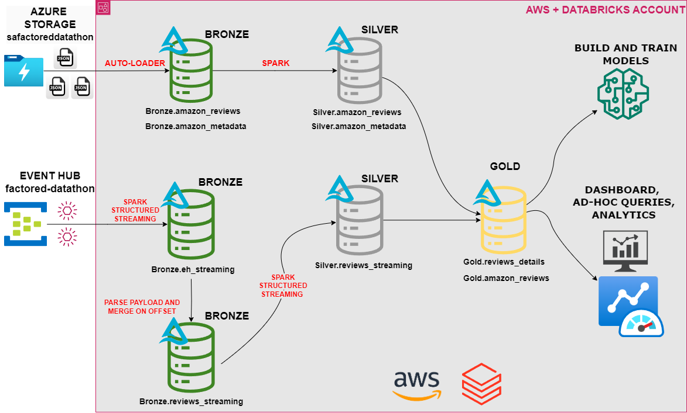
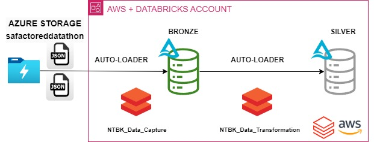
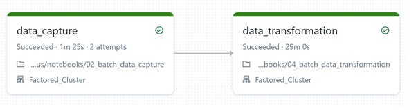
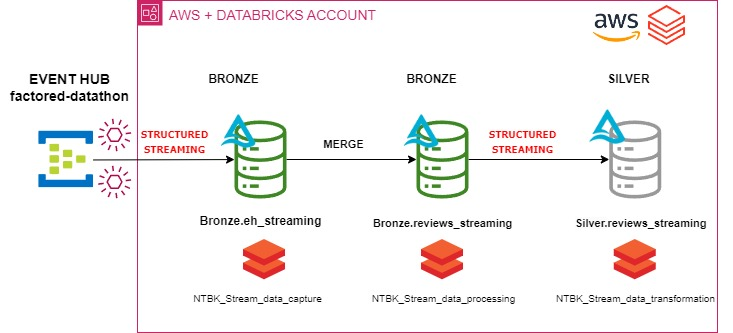
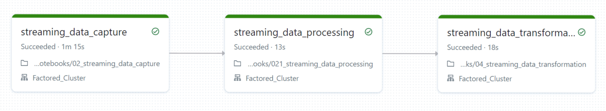
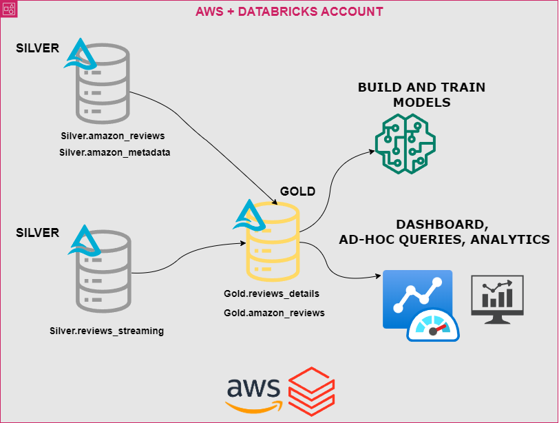
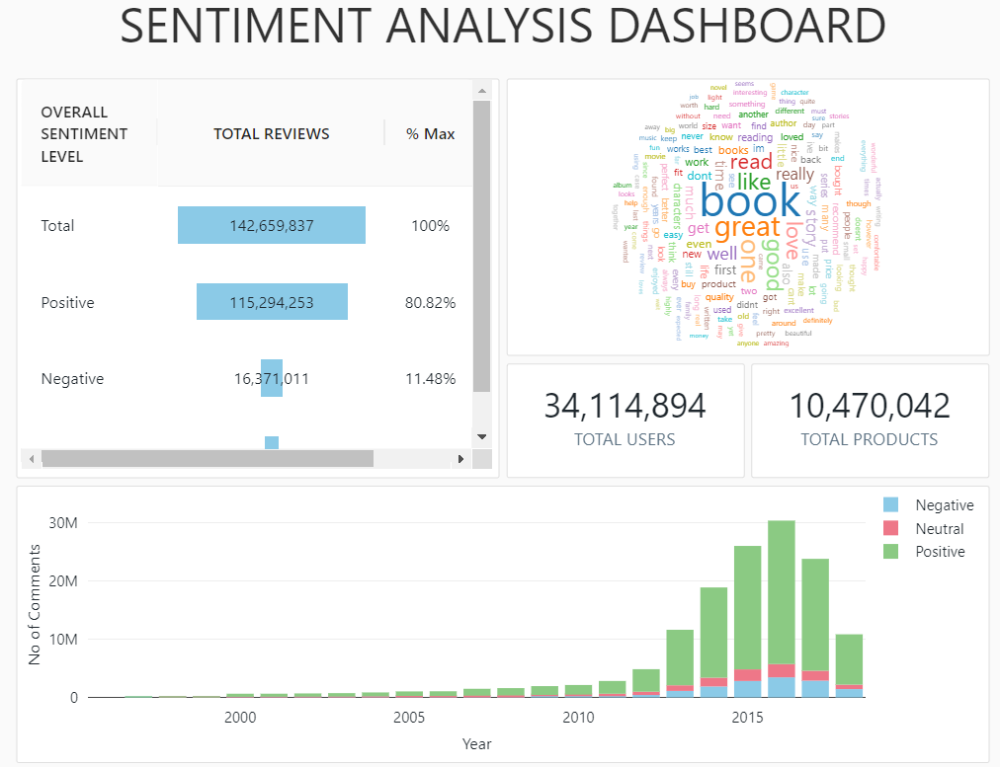
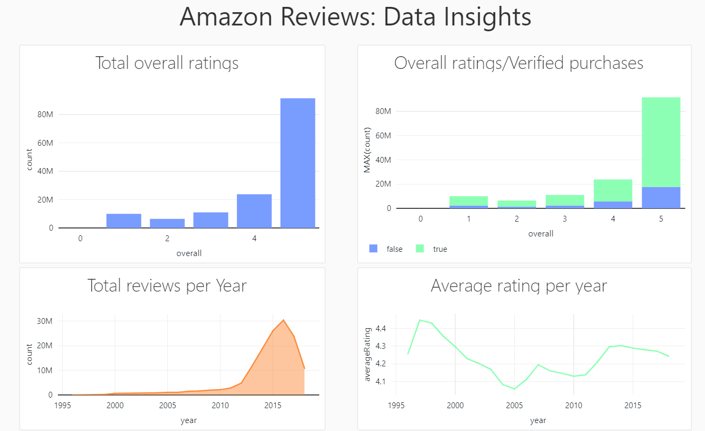
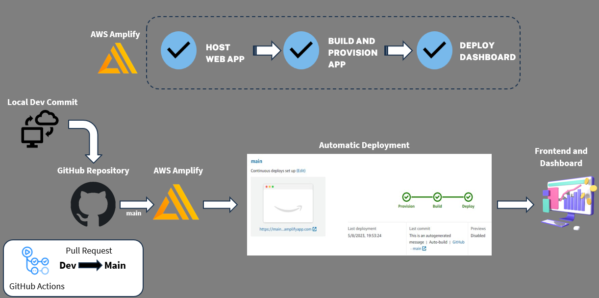

<h1 align="center"> Factored-Datathon-2023 </h1>
<h2 align="center"> 🏆 Welcome to the Winning Solution 🏆 </h2>

  

    

    🌟 Top Honors: Paisa Genious' Factored Datathon Triumph 🌟
    

Feel free to explore our solution; 
we are thrilled to have emerged victorious in the Factored Datathon 2023. Dive in and discover our journey 🚀🔍🌟

**Explore the frontend here: https://main.dpnxkh6elbeqw.amplifyapp.com/**

## 1. **The Team: Paisa Genious**
We are a team composed of two engineers in Medellín, Colombia.

- **Cristina Gomez** is a Bioengineer with a deep passion for leveraging data science and machine learning techniques to drive innovative solutions in the field. She is experienced in applying computational methods to analyze complex challenges.
    
- **Daverson Arenas** is a Mechanical Engineer with a diverse background in engineering. Along Daverson's journey, he found himself captivated by the world of data and cloud computing technologies. Currently, he is working as a Data Engineer.

## 2. **The challenge: Factored Datathon 2023**

- ### ***Overview***

The challenge for the Datathon is to effectively integrate batch and streaming data sources, and combine them to feed the source of truth for analytics and machine learning purposes, to extract valuable patterns, trends, and correlations, enhancing the ability of the business to develop innovative and impactful solutions

- ### ***Data Sources***

Datathon involved two data sources available for the competition: 
* The first source involves two batch-format tables stored in an Azure Data Lake Storage instance.
* The second source involves Amazon Product Reviews, available in streaming mode stored in Azure Event Hub. Our team will be connecting for a specific group created to consume a specific topic.

## 3. **The Solution: AWS cloud and Databricks Lakehouse Architecture**

The primary goal of Team Paisa Genious's solution is to develop an innovative data solution that empowers businesses with actionable insights from Amazon product reviews. The team aims to leverage the capabilities of Databricks and AWS to design a Delta Lakehouse architecture capable of handling both batch and streaming data. By effectively combining data from multiple sources, the proposed solution seeks to enable comprehensive analytics and support machine learning applications.

- ### ***Unified Data Platform: An Integrated Architecture Approach***

    For this challenge, Team Paisa Genious proposes a Delta Lakehouse architecture using Databricks with AWS Cloud, which offers an integrated solution for both batch and streaming data processing. The data lakehouse combines the best features of two worlds: data lakes and data warehouses. The data design pattern is called the "multi-hop" or medallion pattern, used to logically organize data in a lakehouse. The goal is to incrementally and progressively improve the structure and quality of data as it flows through each layer of the architecture (from Bronze ⇒ Silver ⇒ Gold layer tables). This architecture will enable the team to leverage the advantages of both static and dynamic data to extract valuable patterns, trends, and correlations, thereby enhancing the potential to develop impactful solutions during the Datathon. 

  

    The key aspects for choosing this design are its simplicity in the data model, making it easy to understand and implement. It allows us to implement incremental ETL, and we can recreate our tables from raw data at any time. Not to mention the advantages of delta tables, such as ACID transactions and time travel. By leveraging Databricks and AWS, we gain scalability, performance, and reliability. Databricks' unified analytics platform seamlessly integrates with AWS, empowering efficient collaboration and complex analytics. The seamless integration with AWS Cloud unlocks cost-effective storage and compute resources.

<table style="width: 100%;">
  <tr>
    <td style="text-align: center; padding: 10px; width: 33%;">
      
    </td>
    <td style="text-align: center; padding: 10px; width: 33%;">
      
    </td>
    <td style="text-align: center; padding: 10px; width: 33%;">
      
    </td>
  </tr>
</table>

## 4. **Data Engineering: Dealing with the Extraction and Transformation of the data**

The data engineering solution we implemented showcases a remarkable combination of Databricks Auto Loader's incremental ingestion capabilities and Spark's streamlined processing using Structured Streaming. This approach enables us to handle large-scale data processing efficiently in a distributed environment while maintaining the convenience of batch-like operations for optimal results.

- ### ***Batch Ingestion with Databricks Auto Loader***

  -   **Data Ingestion**

      To efficiently handle the incremental ingestion of new data files in batches, we opted to use Databricks Auto Loader. This powerful feature automatically ingests new data files as they arrive in the cloud storage without any additional setup. We utilized Auto Loader's capabilities to load data files from Azure Data Lake Storage Gen2 in JSON format, effectively managing both batch reviews and metadata

  -   **Data Processing and Transformation**

      We employed Spark Structured Streaming to handle data processing and transformation tasks, to turn the streaming query into a batch-like behavior, we strategically incorporated .trigger(availableNow=True) in the Spark Structured Streaming job. This allowed us to process all available data from the bronze tables, thereby ensuring comprehensive data processing at each execution. We created two managed tables in the silver layer named "silver.amazon_metadata" and "silver.amazon_reviews." These tables contain deduplicated, and transformed data

  

    
  

  
  -   **Workflow Automation**

      To ensure seamless execution of the data capture and data processing tasks on a daily basis, we designed a robust workflow in Databricks. This workflow triggers and executes the two notebooks in sequence, orchestrating the entire data pipeline efficiently. The first notebook, "batch_data_capture," utilizes Databricks Auto Loader to load the latest data into the bronze layer tables. Subsequently, the second notebook, "04_batch_data_transformation," leverages Spark Structured Streaming to process and transform the data into clean and deduplicated tables within the silver layer. By automating this workflow, we achieve regular updates to the silver layer and maintain data accuracy and freshness.

   
  
  

    
  

- ### ***Streaming data with Spark structured streaming***

    - **Streaming data capture**
    
      The streaming data engineering solution involves processing real-time data from an event hub that contains Amazon product review information. The data is distributed in partitions and the payload have the same structure as amazon_reviews table for batch processing. The data is streamed into a DataFrame using the Spark spark.readStream function, ensuring that the processing stays up-to-date in real-time. The streaming data is written into a "bronze.eh_streaming" table with the appropriate schema to capture the raw event data. This serves as the bronze layer, housing the unprocessed and raw streaming data

    - **Streaming data processing**

      As part of the data processing pipeline, we leverage the power of Spark SQL to parse and clean the raw event data obtained from the event hub. A temporary view called "events_strings" is created to parse the raw event body into a readable JSON format, and another temporary view called "parsed_events" is created to extract specific fields from the JSON data. This parsing process ensures that the data is well-structured and organized for seamless integration into downstream analytics processes. To guarantee the integrity and consistency of the data, we adopt an incremental loading strategy when transferring the processed data from the temporary view "parsed_events" to the target Delta table, "bronze.reviews_streaming." We leverage the **MERGE** statement, which identifies the presence of matching "offset" values between the source and destination tables, this approach effectively avoids the duplication

    - **Streaming data processing**

      To keep the silver layer up-to-date in real-time, the streaming data is loaded from the "bronze.eh_streaming" table into the "silver.reviews_streaming" table using Spark Structured Streaming. The data is transformed in real-time, including casting the "overall" column to a DecimalType and converting the "unixReviewTime" column to a date format. Additionally, a "processing_time" column is added to capture the time of data processing. This ensures that the silver layer remains continuously updated with the latest transformed data.

   
  
    

      
    

   
  
    - **Workflow Automation**

      A workflow is established in Databricks to orchestrate and automate the streaming data capture and data processing tasks on a daily basis. This workflow triggers and executes the relevant notebooks in sequence, providing a seamless and efficient data pipeline. The streaming data capture and processing jobs run at regular intervals, ensuring the silver layer is always kept current and accurate.

   
  
    

      
    

  
- ### ***Gold Layer: Business level Aggregates***

    - **Pipeline from Silver to Gold**

      In this section, we will discuss the data engineering pipeline responsible for transforming Amazon reviews data from both batch and streaming sources into the Gold layer, where we focus on generating business-level aggregates for analytics and machine learning purposes. The initial step of the pipeline involves joining data from both batch and streaming sources, this unified dataset serves as the foundation for subsequent transformations and analyses. Following the data integration step, we transform string-based product prices into integer values to obtain the actual price of products. Additionally, we perform imputation of missing price categories using the mean value from existing data. We also address data quality by removing any HTML tags present in columns such as main category, brand, and titles. Furthermore, we apply general text processing strategies to handle any other missing or incomplete data, ensuring a thorough data cleansing process.
      
      The Gold layer aims to deliver continuously updated, clean data to downstream users and applications, including machine learning models, ad-hoc queries, and analytics tools.

      By implementing these transformations and data cleansing strategies, we ensure that the Gold layer provides accurate and reliable business-level aggregates, facilitating valuable insights for various stakeholders within the organization. This unified dataset, derived from both batch and streaming sources, serves as a powerful resource for analytics and machine learning purposes, empowering data-driven decision-making and driving the organization's success.
      
     
      

        
      

## 5. **Data Science: Machine learning models**

  In this project we use the Apache Sparke framework to perform text classification of Amazon reviews,with Databricks plataform and MLflow library that help us with the development and evaluation of a sentiment analysis model for Amazon product reviews and a recommendation system for personalized product recommendations.

  The objective of this project was to analyze sentiments expressed in Amazon reviews and provide users with personalized product recommendations based on their preferences.

- ### Sentiment Analysis Model
  
    

      
    

     
  
    - **Dataset**:

      The final dataset used for sentiment analysis contains 12.000.000 Amazon reviews after having performed undersampling to balance the labels categorized into 2 classes: positive and negative. Before training, we performed data cleaning to remove any irrelevant information, suh as html tags, puntuaction, urls, numerical characters, etc, and tokenized the reviews for further analysis.

      For this model two approaches were employed to create the "label" column for sentiment classification:

    - **Approach 1 - Based on "Overall"**:

      The "overall" column provided the rating values (ranging from 1 to 5) given by users for the products. To convert these ratings into sentiment labels, we mapped the labels as follows:

      - If the "overall" rating was less or equal than 3, we labeled it as "negative".
      - If the "overall" rating was greater than or equal to 3, we labeled it as "positive".

    - **Approach 2 - Polarity Calculation"**:
    
      In this approach, we calculated the polarity of each review using a pre-trained sentiment analysis lexicon (TextBlob). The lexicon-based approach assigned a polarity score to each review, indicating its positivity or negativity.

      - Reviews with a polarity score greater than 0 were labeled as "positive".
      - Reviews with a polarity score less or equal than 0 were labeled as "negative".
  
    ### Feature Extraction - Term Frequency (TF) Vectors:
    To convert the tokenized and filtered text data into numerical features suitable for training, we employed the HashingTF feature transformer from PySpark. This transformation generated TF word vectors, capturing the frequency of words in each review.
    
    ### Model Architecture - Logistic Regression:
    For sentiment classification, we chose the logistic regression algorithm due to its simplicity and effectiveness for multi-class and binary classification tasks. The TF word vectors were fed into the logistic regression model for training.

    ### Cross-Validation:
    To prevent overfitting and assess the model's generalization performance, we implemented k-fold cross-validation using PySpark's CrossValidator. This process split the dataset into k-folds and trained the model on different combinations of the folds, providing robust performance estimates.

    ### Evaluation and Results:
    The sentiment analysis model's performance was evaluated using the metrics showed in the following image:

   
  
    

      
    

 
   
  
    The accuracy of 0.658 indicates that the model is correctly classifying sentiments for approximately 65.8% of the test instances. While this is better than random guessing, there is still room for improvement to achieve higher accuracy.

    The F1 score of 0.657 combines both precision and recall metrics and is a good measure of overall model performance, especially for imbalanced datasets. It is encouraging that the F1 score is close to the accuracy score, suggesting that the model is performing consistently across classes.

    The AUC-ROC score of 0.701 indicates that the model has a moderate ability to discriminate between positive and negative sentiments. An AUC value greater than 0.5 indicates that the model performs better than random guessing, but improvements can be made to increase the AUC value further.

## 6. **Frontend and Continuous Deployment**

We decided to develop a frontend that encapsulates and presents the main components of our data solution. For the frontend, we chose to use plain HTML, keeping it simple and efficient while focusing on a seamless user experience.

### Frontend Solution

Our frontend aimed to provide an intuitive interface for users to interact with the data and insights generated by our solution. The key components and features of our frontend include:

- **Dashboard:** We designed interactive dashboards that visualizes the results and findings from our data analytics and machine learning processes.

   
  
    

      
      
    

### Continuous Deployment with AWS Amplify

For hosting our frontend and the associated dashboards, we harnessed the power of AWS Amplify. This cloud service not only simplified the deployment process but also streamlined the integration with our GitHub repository.

#### Key Benefits of AWS Amplify for Continuous Deployment:

1. **Automation:** AWS Amplify automated the building and deployment of changes whenever commits were pushed to our repository. This eliminated the need for manual deployment and ensured that the latest version of our frontend was always available to users.

2. **Scalability:** As our user base grew, AWS Amplify effortlessly scaled our hosting resources, ensuring consistent performance and reliability.

3. **Integration:** The seamless integration with GitHub allowed our development team to focus on coding while Amplify took care of the deployment pipeline.

4. **Secure and Compliant:** AWS Amplify adheres to industry best practices for security and compliance, giving us peace of mind that our frontend was hosted in a secure environment.

5. **Monitoring and Analytics:** Amplify provides built-in monitoring and analytics tools, enabling us to gain insights into user behavior and optimize our frontend accordingly.

By choosing AWS Amplify for continuous deployment, we ensured that our frontend was not only user-friendly but also highly available, scalable, and reliable.

      

---

