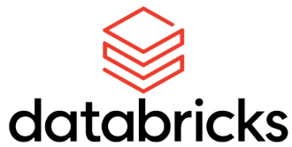
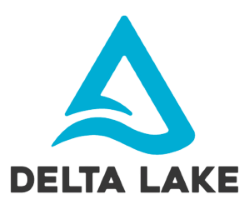

# factored-datathon-2023

## 1. **The Team: Paisa Genious**
We are a team composed of two engineers in Medellin, Colombia.

**Cristina Gomez** is a Bioengineer with a deep passion for leveraging data science and machine learning techniques to drive innovative solutions in the field. She is experienced in applying computational methods to analyze complex challenges.

**Daverson Arenas** is a Mechanical Engineer with a diverse background in engineering. Along Daverson's journey, he found himself captivated by the world of data and cloud computing technologies. Currently, he is working as a Data Engineer.

## 2. **The challenge: Factored Datathon 2023**

- ### ***Overview***

The challenge for the Datathon is to effectively integrate batch and streaming data sources, and combine them to feed the source of truth for analytics and machine learning purposes, to extract valuable patterns, trends, and correlations, enhancing the ability of the business to develop innovative and impactful solutions

- ### ***Data Sources***

Datathon involved two data sources available for the competition: 
* The first source involves two batch-format tables stored in an Azure Data Lake Storage instance.
* The second source involves Amazon Product Reviews, available in streaming mode stored in Azure Event Hub. Our team will be connecting for a specific group created to consume a specific topic.

## 3. **The Solution: AWS cloud and Databricks Lakehouse Architecture**

The primary goal of Team Paisa Genious's solution is to develop an innovative data solution that empowers businesses with actionable insights from Amazon product reviews. The team aims to leverage the capabilities of Databricks and AWS to design a Delta Lakehouse architecture capable of handling both batch and streaming data. By effectively combining data from multiple sources, the proposed solution seeks to enable comprehensive analytics and support machine learning applications.

- ### ***Unified Data Platform: An Integrated Architecture Approach***

For this challenge, Team Paisa Genious proposes a Delta Lakehouse architecture using Databricks with AWS Cloud, which offers an integrated solution for both batch and streaming data processing. The data lakehouse combines the best features of two worlds: data lakes and data warehouses. The data design pattern is called the "multi-hop" or medallion pattern, used to logically organize data in a lakehouse. The goal is to incrementally and progressively improve the structure and quality of data as it flows through each layer of the architecture (from Bronze ⇒ Silver ⇒ Gold layer tables). This architecture will enable the team to leverage the advantages of both static and dynamic data to extract valuable patterns, trends, and correlations, thereby enhancing the potential to develop impactful solutions during the Datathon. 

  

The key aspects for choosing this design are its simplicity in the data model, making it easy to understand and implement. It allows us to implement incremental ETL, and we can recreate our tables from raw data at any time. Not to mention the advantages of delta tables, such as ACID transactions and time travel. By leveraging Databricks and AWS, we gain scalability, performance, and reliability. Databricks' unified analytics platform seamlessly integrates with AWS, empowering efficient collaboration and complex analytics. The seamless integration with AWS Cloud unlocks cost-effective storage and compute resources.

<table style="width: 100%;">
  <tr>
    <td style="text-align: center; padding: 10px; width: 33%;">
      
    </td>
    <td style="text-align: center; padding: 10px; width: 33%;">
      
    </td>
    <td style="text-align: center; padding: 10px; width: 33%;">
      
    </td>
  </tr>
</table>

## 4. **Data Engineering: Dealing with the Extraction and Transformation of the data**

The data engineering solution we implemented showcases a remarkable combination of Databricks Auto Loader's incremental ingestion capabilities and Spark's streamlined processing using Structured Streaming. This approach enables us to handle large-scale data processing efficiently in a distributed environment while maintaining the convenience of batch-like operations for optimal results.

- ### ***Batch Ingestion with Databricks Auto Loader***

  -   **Data Ingestion**
To efficiently handle the incremental ingestion of new data files in batches, we opted to use Databricks Auto Loader. This powerful feature automatically ingests new data files as they arrive in the cloud storage without any additional setup. We utilized Auto Loader's capabilities to load data files from Azure Data Lake Storage Gen2 in JSON format, effectively managing both batch reviews and metadata

  -   **Data Processing and Transformation**
We employed Spark Structured Streaming to handle data processing and transformation tasks, to turn the streaming query into a batch-like behavior, we strategically incorporated .trigger(availableNow=True) in the Spark Structured Streaming job. This allowed us to process all available data from the bronze tables, thereby ensuring comprehensive data processing at each execution. We created two managed tables in the silver layer named "silver.amazon_metadata" and "silver.amazon_reviews." These tables contain deduplicated, and transformed data

  

  

- ### ***Streaming data with Spark structured streaming***

Databricks recommends Auto Loader in Delta Live Tables for incremental data ingestion. Auto Loader incrementally and efficiently processes new data files as they arrive in cloud storage. Auto Loader provides a Structured Streaming source called cloudFiles. Given an input directory path on the cloud file storage, the cloudFiles source automatically processes new files as they arrive, with the option of also processing existing files in that directory. Auto Loader has support for both Python and SQL in Delta Live Tables.

